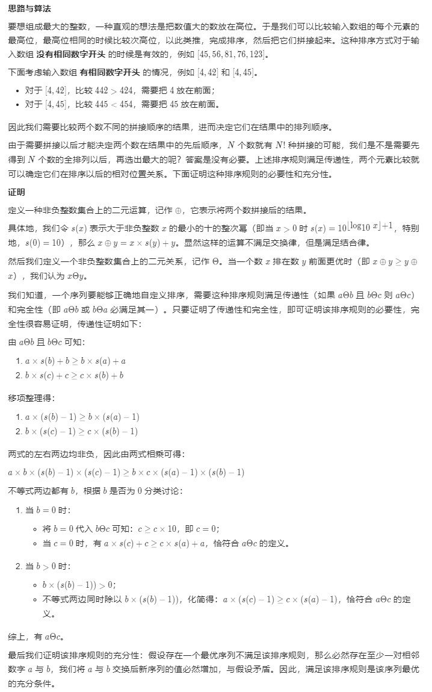

# 179. 最大数

> 难度：中等
> 链接：`https://leetcode-cn.com/problems/largest-number/`
> 时间：2021-4-12

## 题目描述

给定一组非负整数 nums，重新排列每个数的顺序（每个数不可拆分）使之组成一个最大的整数。
**注意**：输出结果可能非常大，所以你需要返回一个字符串而不是整数。

## 思路

第一感觉是按照字符序就行了，后来发现了 `30` 和 `3` 这两个，**猝**；
后来想了下直接比较两个互换位置后的字符串，也没想其它；后来看了官方题解，**数学证明是王道**。

## 证明



## 代码

```javascript
/**
 * @param {number} n
 * @return {number}
 */
// 自己的代码字符串比较
var largestNumber = function (nums) {
    nums.sort((a, b) => {
        let astr = a.toString() + b.toString();
        let bstr = b.toString() + a.toString();
        if (astr > bstr) {
            return -1;
        }
        if (astr < bstr) {
            return 1;
        }
        return 0;
    });
    if (nums[0] === 0) {
        return 0;
    }
    return nums.join("");
};

// 官方的代码，数字比较；但是最后一步是什么意思？我认为无需转换为字符串
var largestNumber = function(nums) {
    nums.sort((x, y) => {
        let sx = 10, sy = 10;
        while (sx <= x) {
            sx *= 10;
        }
        while (sy <= y) {
            sy *= 10;
        }
        return '' + (sx * y + x) - ('' + (sy * x + y));
    })
    if (nums[0] === 0) {
        return '0';
    }
    return nums.join('');
};
```

## 总结

想再学离散数学了~